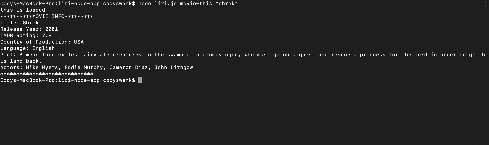

# liri-node-app

# When you input node liri.js movie-this "shrek"

# When you input node liri.js movie-this

# When you input node liri.js spotify-this-song "r u mine"

# When you input node liri.js concert-this "ariana grande"

# When you input node liri.js do-what-it-says 

